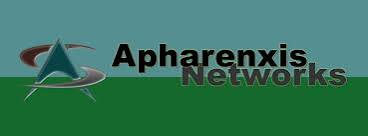

# Apharenxis Networks, Inc. 

### IT as a Way of Life · Innovation as a Practice · Excellence as a Standard

---

## About Us

**Apharenxis Networks, Inc.** is a dynamic team of IT professionals empowering entrepreneurs, professionals, and businesses to thrive in the digital landscape. We sit at the intersection of strategy and infrastructure — translating ambitious ideas into resilient, secure, and scalable technology.

Apharenxis Networks operates as a **Parlee Conseiller Company**, the technology and cloud division within the [Parlee Conseiller](https://parlee.net) ecosystem of business units.

Our teams carry deep, field-tested experience:

| Discipline | Experience |
|---|---|
| Web Development | 15+ years |
| Hardware & Software | 12+ years |
| Systems & Networks | 10+ years |
| Process Auditing | 5+ years |

That experience spans technology, education, retail, agribusiness, security, banking, telecommunications, and consulting — giving us the range to support clients from early-stage startups to established enterprises.

---

## What We Do

| Service | Description |
|---|---|
| **Digital Strategy** | Corporate image, marketing campaigns, and digital presence optimization |
| **Network Systems** | Enterprise network infrastructure design, implementation, and management |
| **CRM & ERP** | End-to-end deployment of CRM, ERP, and Business Intelligence platforms |
| **Security & Monitoring** | Security architectures with continuous monitoring |
| **Process Auditing** | Operational workflow and KPI optimization |
| **Web & App Development** | E-commerce, portals, social networks, and custom software |

### Impulse — Our Acceleration Program

**Impulse** is our structured engagement model for organizations ready to modernize: comprehensive operational analysis, technology platform implementation, data warehouse management, and a strategic roadmap built to scale.

### Education & Thought Leadership

Beyond consulting, we deliver lectures and keynotes at universities, business schools, and corporate summits on Internet Business Models, Online Marketing, Systems Development, and Networking Architecture.

---

## Platforms

| Platform | Purpose |
|---|---|
| [projects.aphx.net](https://projects.aphx.net) | Client & internal projects dashboard |
| [dashboard.aphx.net](https://dashboard.aphx.net) | Intranet |
| [support.parlee.net](https://support.parlee.net) | Help & support desk |
| [cloud.parlee.net](https://cloud.parlee.net) | Cloud console |
| [appliances.parlee.net](https://appliances.parlee.net) | Virtual appliances |

---

## Get in Touch

- **Security reports:** security@aphx.net
- **Code of Conduct:** conduct@aphx.net
- **Web:** [aphx.net](https://aphx.net)

---

© 2001–2026 Apharenxis Networks, Inc. · A Parlee Conseiller Company
Licensed under MIT unless otherwise noted in individual repositories.

